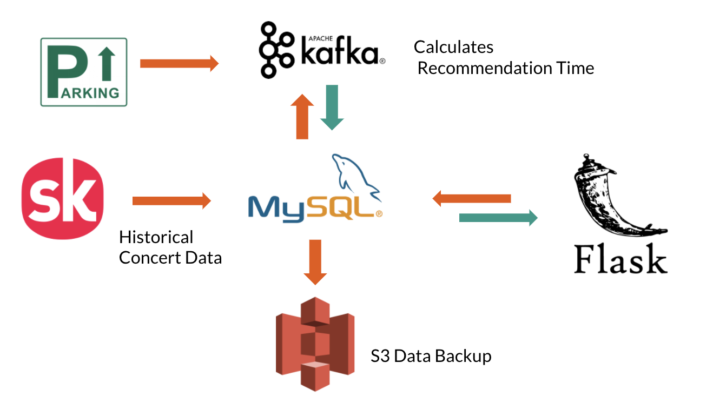

# ConcertGo

## Table of Contents

1. [Motivation](README.md#motivation)
1. [File Overview](README.md#file-overview)
1. [Architecture](README.md#architecture)
1. [User Guide](README.md#user-guide)
1. [Contact Information](README.md#contact-information)

## Motivation

The pain of finding parking space in increasingly overcrowded cities is shared by every car owner, especially during busy events such as game and concert. Many concert-goers experience a common frustration when they arrive early at the venue yet still cannot find an available parking spot, and end up spending much more time on the parking and less on enjoying the show. Needless to say, this can be a major buzzkill and does not have an easy solution.

ConcertGO is a platform that provides concert-goers with nearest parking lot options and recommendation on when they should arrive prior to the concerts so they can find a parking space using data analytics. It calculates the recommendation time for each parking lot based on past parking data during past concert events that happened within a 2 kilometer radius. ConcertGO not only helps users with their parking problem, it also sheds light on how crowded events like concerts can affect the performance of parking lots.

## File Overview

### backend

`backend/` contains all the files that are in charge of retrieving data, creating the database, calculating the recommendation time based on past events, monitoring future events, updating the database and updating the recommendation time, etc.

#### data_gen.py and script.py
`data_gen.py` and `script.py` collect past concert data in JSON files through Songkick API requests and write data into MySQL database. Since the past concert data can only be collected by specifying the Event_ID or Artist_ID of that event, and both IDs are not provided to API users in an easily collectable way, the approach here is to iterate through all possible Artist IDs from 1 to 10,000,000 and distribute the tasks on multiple EC2 instances to speed up the process. All the data collected contain the event_id, name of the event, datetime of the event, location of the event in coordinates and the city where the event took place.

#### future_data.py
`future_data.py` collect future concert data in JSON files through Songkick API requests and write data into MySQL database. 

#### db.py
`db.py` creates the class `EventDataBase` that manages the MySQL database with functions that create tables, insert/delete event data values into/from tables.

#### update_recommendation.py and create_recommendation.py
`update_recommendation.py` and `create_recommendation.py` calculate the recommendation time for each parking lot. For each given past concert, the coordinates location and exact time of the event are extracted to pin point parking lots near the venue (within 2 kilometers), and for each eligible parking lot, all the available spaces information of the two hours before the concert is collected using 24 API calls as the parking data is generated every five minutes. With that data, it is easy to measure how the number of available spaces within the parking lot changes before a concert, and to calculate a max-out time of the parking lot's capacity based on the trend. Here, 70% of the maximum capacity of the parking lot is used as a critical value for the recommendation time, namely, ConcertGO anticipates when the parking lot will fill up to 70% of its total number of spaces, and recommends the concert-goers to arrive at least before that time. After the "recommendation time" is calculated for each past event, a general recommendation time for a particular parking lot can be measured using the average of all "recommendation times" for all the events correlated with that parking lot. 

#### process_parking.py and app.py
`process_parking.py` and `app.py` process user inputs from the frontend and returns the parking lots information, including the name and the recommendation time of the parking lots which are within 1 kilometer distance from the concert venue.

### Frontend

`Frontend/` contains HTML, CSS, JS files for the frontend of the platform. 

## Architecture

The past concerts data are collected through API requests on multiple EC2 instances and stored into MySQL database. All concerts data are backed up in S3 with AWS Database Migration Service. The task of calculating the recommendation time of each parking lot is distributed using Kafka on AWS MSK, and the results are stored back into MySQL. The Flask front end handles user's requests from HTML.

## User Guide

User inputs the concert information on http://concertgo.me/, after clicking submit, the map shows the location of the nearby parking lots, and provides the recommendation time for each parking lot in minutes. 

